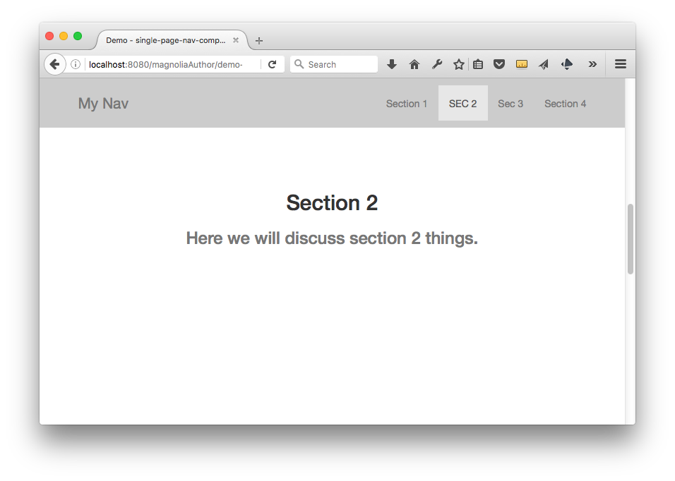

# Single Page Navigation - Component templates for Magnolia CMS #

Navigation for a single page website.

This set of two components provides a navigation which displays internal links to section headers in the page.

## Features ##
Javascript is used to highlight the navigation for whichever section is in the view,
and to provide smooth scrolling when links are clicked.

## Usage ##
Use these components as is, or simply as a starting point or inspiration for how to accomplish this common task.

* Include the files in webresources (And the dependencies listed below) on your pages.
* Make these component templates available in your page.
* Add the singlePageNav component to the top of your page.
* Place a sectionHeader component at the top of each section that you would like a link created to in the navigation.
* - The nav component will display a link for any component with the type "sectionHeader".

### Demo ###
To see an example page demonstrating these components, open the Pages app in Magnolia AdminCentral and import the file in 'dev/importsSamples'.

## Dependencies ##
The HTML markup in these components depends on
* Bootstrap 3 CSS
* Bootstrap JS: scrollspy
* Jquery & Jquery easing

## Information on Magnolia CMS
https://docs.magnolia-cms.com

This directory is a 'light module'.
https://documentation.magnolia-cms.com/display/DOCS/Light+development+in+Magnolia

## Contribute to the Magnolia component ecosystem
It's easy to create components for Magnolia and share them on github and npm. I invite you to do so and join the community. Let's stop wasting time by developing the same thing again and again, rather let's help each other out by sharing our work and create a rich library of components.

Just add magnolia-light-module and magnolia-component as keywords to the package.json to make them easy to find and use.

## Notes
* This is not officially supported Magnolia CMS code. This is a community contribution.
* Your input is welcome! Just file a ticket, or create a pull request on github.

## License

MIT

## Contributors

Christopher Zimmermann, @topherzee
